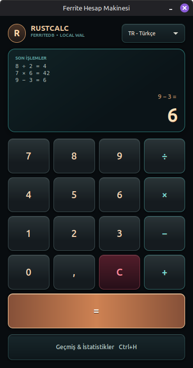
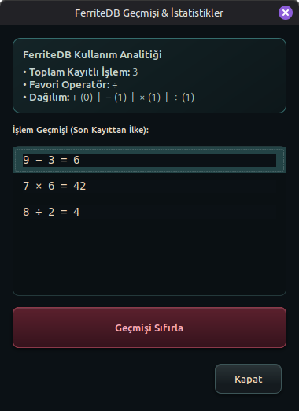

# RustCalc

A deliberately small Rust desktop calculator that demonstrates how to embed [FerriteDB](https://github.com/Koray-Ozt/FerriteDB) in a real application.

> **Example project:** RustCalc is intended as a compact FerriteDB usage example, not as a feature-complete calculator. FerriteDB is currently an unaudited beta; do not use it for production, security-critical workloads, or irreplaceable data.

## Interface

<p align="center">
  
  
</p>

<p align="center"><sub>Calculator workspace and FerriteDB-backed history analytics.</sub></p>

## What this example shows

- adding `ferrite-core` as a Git dependency;
- opening or creating a local FerriteDB database;
- writing structured JSON data with `put_key` (`{ id, left, operator, right, result, timestamp }`);
- storing and retrieving user configuration settings (`settings/language`);
- deleting records with `delete_key` to clear history on disk;
- calculating usage statistics and analytics over stored records;
- multi-language support (English, Turkish, Russian) persisted in FerriteDB;
- full keyboard navigation and shortcut handling;
- modern GTK desktop interface with real-time formula expression preview.

## FerriteDB usage

FerriteDB is pinned to its first public beta tag because its Rust crates are not currently published to crates.io:

```toml
[dependencies]
ferrite-core = { git = "https://github.com/Koray-Ozt/FerriteDB.git", tag = "v0.1.0-beta.1" }
serde = { version = "1.0", features = ["derive"] }
serde_json = "1"
```

### 1. Open the database

`Database::open` creates the database directory when necessary and recovers committed records from the write-ahead log when it already exists.

```rust
use ferrite_core::Database;

let db = Database::open("data/history.ferrite")?;
```

### 2. Store structured JSON data and settings

Calculation history entries and application settings are saved as JSON:

```rust
// Store calculation record
let entry = HistoryEntry {
    id: "history/00000000172350000000_0".into(),
    left: 8.0,
    operator: Operator::Divide,
    right: 2.0,
    result: 4.0,
    timestamp: 1723500000000,
};
db.put_key(&entry.id, serde_json::to_value(&entry)?)?;

// Store language preference
db.put_key("settings/language", serde_json::to_value("en")?)?;
```

### 3. Clear history with `delete_key`

Deleting all calculation history keys from FerriteDB:

```rust
let keys: Vec<String> = db
    .list(Some("history/"))?
    .into_iter()
    .map(|(k, _)| k)
    .collect();

for key in keys {
    db.delete_key(&key)?;
}
```

## Shortcuts

- **Digits / Decimals:** `0`-`9`, `,`, `.`
- **Operators:** `+`, `-`, `*`, `/`
- **Calculate:** `Enter`, `Numpad Enter`, `=`
- **Clear / Backspace:** `Escape`, `c`, `BackSpace`
- **History & Analytics:** `Ctrl+H`, `h`

## Requirements

- Rust and Cargo
- GTK 3 development libraries

On Ubuntu or Linux Mint:

```bash
sudo apt update
sudo apt install libgtk-3-dev
```

## Run

The easiest installation on Ubuntu 24.04 or Linux Mint 22 is the `.deb` package attached to the latest [GitHub prerelease](https://github.com/Koray-Ozt/RustCalc/releases):

```bash
sudo apt install ./rust-calc_0.1.0-alpha.2_amd64.deb
```

Alternatively, run from source:

```bash
git clone https://github.com/Koray-Ozt/RustCalc.git
cd RustCalc
cargo run --release
```

By default, history is stored in `$XDG_DATA_HOME/rust-calc/history.ferrite`, or `~/.local/share/rust-calc/history.ferrite` when `XDG_DATA_HOME` is unset. Override the location with:

```bash
RUST_CALC_DATA=/tmp/rust-calc-data cargo run --release
```

### Upgrading from alpha.1

FerriteDB beta intentionally refuses to open the unversioned alpha database format. RustCalc now uses a new format-1 database under the platform data directory and leaves the previous repository-relative `data/history.ferrite` untouched. Calculation history from alpha.1 is not migrated automatically.

## Verify

```bash
cargo test --all-targets
cargo fmt --all --check
cargo clippy --all-targets -- -D warnings
cargo build --release
```

## Project layout

```text
src/lib.rs          Calculator logic, i18n dictionary, and FerriteDB HistoryStore
src/main.rs         GTK desktop interface, keyboard listener, and stats modal
docs/screenshots/   Current calculator and history interface screenshots
tests/calculator.rs Calculator and i18n behavior tests
tests/data_path.rs  Platform data-directory resolution tests
tests/history.rs    FerriteDB restart, clear, and language persistence tests
scripts/            Reproducible Linux release packaging
packaging/          Desktop integration metadata
```

## Scope and limitations

- This example uses FerriteDB's Rust core directly rather than its sidecar protocol.
- The dependency is tag-pinned while FerriteDB's Rust API remains unstable.
- FerriteDB and RustCalc currently provide no production-readiness guarantee.
- This repository currently has no license file; public visibility does not grant permission to copy, modify, or redistribute its contents.
- Binary packages include Debian copyright metadata, FerriteDB attribution, and complete bundled dependency license texts.

For FerriteDB's architecture, CLI, sidecar protocol, TypeScript SDK, and current limitations, see the [FerriteDB repository](https://github.com/Koray-Ozt/FerriteDB).
